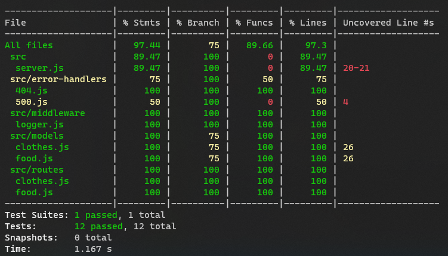
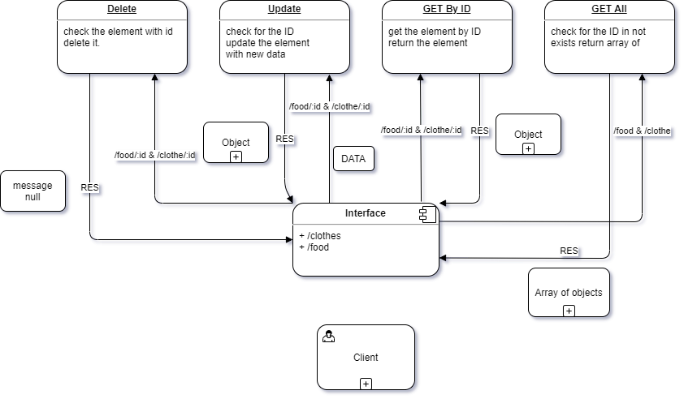

# basic-api-server

## API Feature

- Get all data realted to food or clothes in the routes `/food`, `/clothe`.

- Get a certain data about food or clothes in the routes `/food/:id`, `/clothes/:id`.

- Add data related to food or clothes in the routes `/food`, `/clothes`.

- Upgrade existing data related to food or clothes `/food/:id`, `/clothes/:id` and send new data to this routes.

- Delete existing data realted to food or clothes `/food/:id`, `/clothes/:id`.

_all feature have been implemented in the `dev` branch_

## URL links

- main branch
  [omar-server-deploy-prod](https://oht-api-server.herokuapp.com/)

- Github Pull Request
  [Pull-Request](https://github.com/Omar-Tarawneh/basic-api-server/pull/1)

- Action
  [Action](https://github.com/Omar-Tarawneh/basic-api-server/actions)

## Feature tests

you can check from the action tap for all the test - the link provided above- or just test it in you local machine the final resulte is like this.

## Data Flow Diagram

## Download And Start

- Clone the Repository into your local machine
  `git clone httpLink/sshlink`

- Get into the repo directory
  `cd basic-api-server`

- Install the dependences for tha app
  `npm install`

- Add your dotenv File and add your PORT
  `touch .env`
  `PORT=3000`

- Test the functionality of the app by typing:
  `npm test`

- Then to start the server type in the terminal:
  `npm start`
